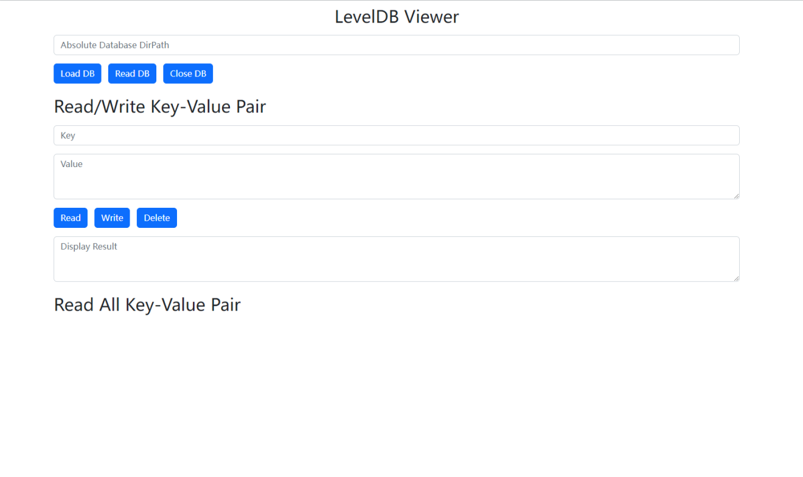

[English](./README_en.md)
## User Guide
1. Environment Setup
   Requires node environment
   ```bash
   npm install
   ```
2. Run Backend
   ```bash
   cd services
   node main.js
   ```
3. Getting Started
   Start the local server environment, or directly open `index.html` in the browser, enter the absolute folder path of the local LevelDB database, and start using it!

## Operations
1. Database: Load DB (open/new), Read DB (read all content), Close DB (close)
2. Key-Value: Read (read specified key), Write (write/overwrite key-value), Delete (delete specified key)

## Preview
**Home Page**


**Read**


## Notes
1. Absolute folder path cannot be `%LocalAppData%`
2. Cannot reopen a database that is already open, or a database in a running browser. Although the project's operating interface requires opening the browser, you can use another browser or make a copy for operation.
3. `xx\xx\xx\LocalStorage\leveldb\` contains LocalStorage from all websites, which can result in large data and high probability of read/write failure, possibly due to failed Level library operations, ~~possibly due to converting all nested objects into JSON objects for a more elegant display~~, or possibly due to failure in transmitting data via HTTP protocol, ~~or perhaps due to issues in my code~~... (Operate with caution, improper operations may result in local data loss on all websites)

## Appendix

Example LevelDB paths:

Chrome:

- localStorage.getItem:`"%LocalAppData%\BraveSoftware\Brave-Browser\User Data\Default\Local Storage\leveldb"`

Extension:

- chrome.storage.local.get:`%LocalAppData%\BraveSoftware\Brave-Browser\User Data\Default\Local Extension Settings\akapkckdchfdkhbgmnkboidpaljnlimb`

## Improvements:
- [ ]  Failure to open local storage databases for all websites (can use files in the **extra** directory for read-only if needed)
- [ ]  Inability to read and write objects, only strings
- [ ]  Developing new platforms...

## Acknowledgments:
Level: [https://github.com/Level/level](https://github.com/Level/level)  